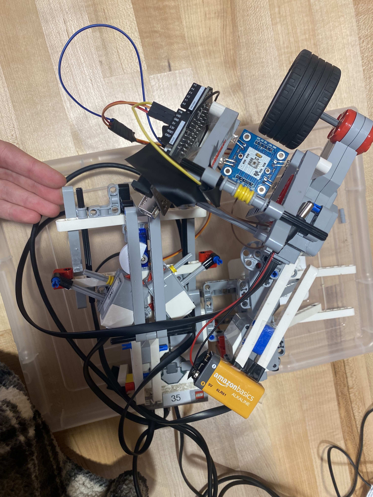
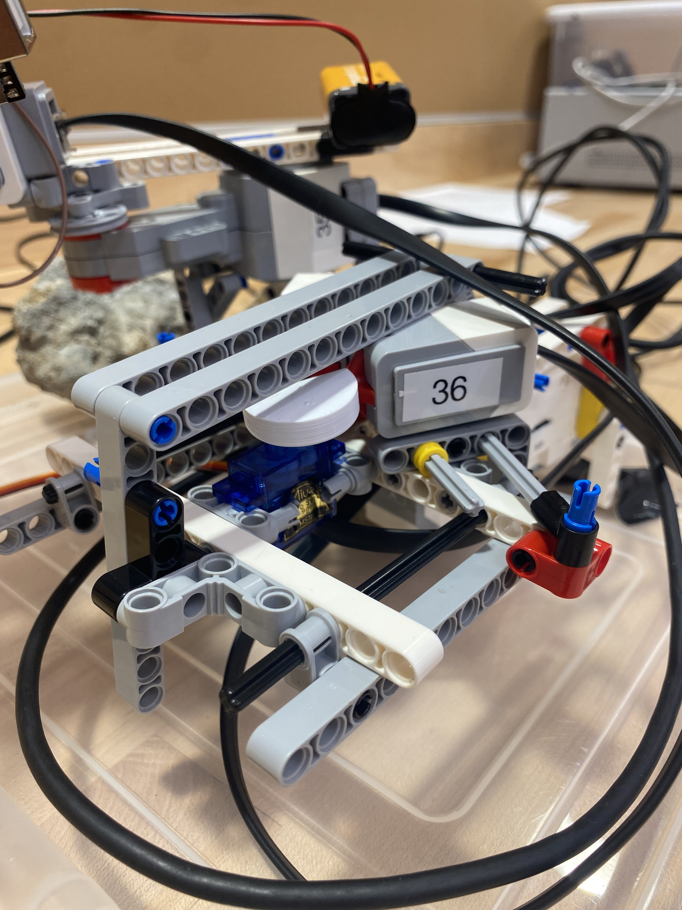

# Arduino Uno Color Sorter
_Sort Uno Cards by their color_

**This code was part of an EGR101 Project 2 competition.**

The program is designed to read the color of an uno card from a stack and actuate a servo based on the read value.

